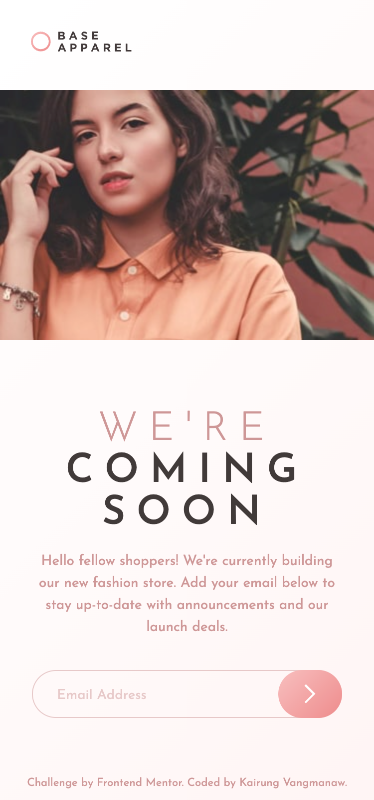
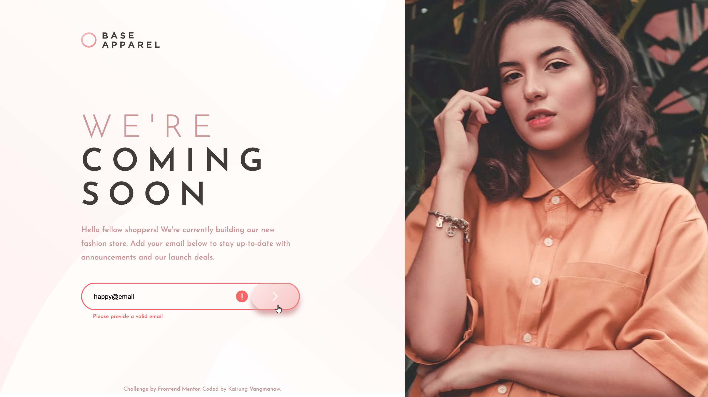

# Frontend Mentor - Base Apparel coming soon page solution


This is a solution to the [Base Apparel coming soon page challenge on Frontend Mentor](https://www.frontendmentor.io/challenges/base-apparel-coming-soon-page-5d46b47f8db8a7063f9331a0). Frontend Mentor challenges help you improve your coding skills by building realistic projects. 

## Table of contents

- [Frontend Mentor - Base Apparel coming soon page solution](#frontend-mentor---base-apparel-coming-soon-page-solution)
  - [Table of contents](#table-of-contents)
  - [Overview](#overview)
    - [The challenge](#the-challenge)
    - [Screenshot](#screenshot)
    - [Links](#links)
  - [My process](#my-process)
    - [Built with](#built-with)
    - [What I learned](#what-i-learned)
    - [Continued development](#continued-development)
    - [Useful resources](#useful-resources)
    - [AI Collaboration](#ai-collaboration)
  - [Author](#author)
  - [Acknowledgments](#acknowledgments)

## Overview

### The challenge

Users should be able to:

- View the optimal layout for the site depending on their device's screen size
- See hover states for all interactive elements on the page
- Receive an error message when the `form` is submitted if:
  - The `input` field is empty
  - The email address is not formatted correctly

### Screenshot

<details>
<summary>Mobile view</summary>

</details>
<details>
<summary>Desktop view</summary>

</details>
<details>
<summary>Active state view</summary>

</details>

### Links

- Solution URL: [Responsive Coming Soon Page with React, Vite, BEM & Accessible Form](https://www.frontendmentor.io/solutions/responsive-coming-soon-page-with-react-vite-bem-and-accessible-form-xzHCyEFFHm)
- Live Site URL: [Frontend Mentor | Base Apparel coming soon page](https://challenged-by-frontend-mentor.github.io/base-apparel-coming-soon/)

## My process

### Built with

- Semantic [HTML5](https://developer.mozilla.org/en-US/docs/Web/HTML) markup
- CSS custom properties (Variables) & Modern CSS Grid / Flexbox
- [BEM Methodology](https://getbem.com/) for clean and scalable class naming
- Mobile-first to desktop responsive workflow
- [React](https://react.dev/) - JS library for building user interfaces
- [Vite](https://vitejs.dev/) - Next Generation Frontend Tooling
- Accessible Form Controls (`aria-invalid`, `aria-describedby`, `role="alert"`)

### What I learned

During this challenge, I ran into several practical layout and state-handling issues that ended up teaching me a lot:

1. **Contextual BEM Styling for Dynamic Borders:** 
   I encountered an issue where changing the form's border width from `1px` to `2px` on validation error caused the absolute-positioned submit button to reveal a red gap behind it. I learned to use contextual BEM selectors to smoothly override button offsets without cluttering React state:

   ```css
   /* Standard state (-1px to cover 1px border) */
   .email__submit-button {
     position: absolute;
     top: -1px;
     bottom: -1px;
     right: -1px;
   }

   /* Error state (-2px to cover 2px border) */
   .email__form--error .email__submit-button {
     top: -2px;
     bottom: -2px;
     right: -2px;
   }
   ```
2. **Clean Desktop Spacing with** `clamp()`:
   Instead of hardcoding multiple breakpoint paddings, I learned to create dynamic viewport units using `:root` CSS variables combined with fluid sizing formula:
   ```css
   @media (min-width: 1024px) {
    :root {
      --pad-desktop-left: clamp(4.375rem, calc(-10.24rem + 22.837vw), 10.313rem);
    }
   }
   ```
3. **Accessible Form Feedback**:
   I moved beyond simple visual error hints by linking input error states directly to descriptive messages for screen readers using `aria-invalid`, `aria-describedby`, and live-region alerts (`role="alert"`).

### Continued development

Moving forward, I want to explore deeper custom validation techniques for email inputs. While native HTML `<input type="email">` handles basic syntax checks (like checking if `@` exists), it lacks comprehensive validation. Implementing custom Regex logic in React gave me a great foundation, and I plan to build on this by exploring advanced form validation patterns—such as domain checking, real-time feedback with debounce, and integrating third-party email verification APIs in future full-stack applications.

### Useful resources

- [MDN: <picture> element](https://developer.mozilla.org/en-US/docs/Web/HTML/Reference/Elements/picture?utm_source=gemini) - Helped me handle art direction efficiently for switching between desktop and mobile hero images.

- [MDN: linear-gradient()](https://developer.mozilla.org/en-US/docs/Web/CSS/Reference/Values/gradient/linear-gradient?utm_source=gemini) - Essential guide for combining subtle background gradients with button active states.

- [MDN: CSS Anchor Positioning](https://developer.mozilla.org/en-US/docs/Web/CSS/Reference/Properties/position-anchor?utm_source=gemini) - Great reading resource on emerging CSS specs for future popovers and tooltips.

- [Kevin Powell: CSS Overlay Techniques](https://www.google.com/search?q=https://youtube.com/watch%253Fv%253Dwqzv-CzJy5k%2526vl%253Den%2526t%253D1&utm_source=gemini) - Extremely helpful tutorial for setting up pixel-perfect design overlays.

- [Fluid Typography & Spacing Calculator](https://clampcalculator.com/?vmin=1024&vmax=1440&pmin=70&pmax=165&vu=vw&ou=rem&root=16&utm_source=gemini) - My go-to generator for calculating accurate CSS `clamp()` values across custom viewports.

### AI Collaboration

Throughout this project, I leveraged **Gemini** and **Google Search AI Mode** as thought partners. They helped me brainstorm CSS edge-case solutions, review code refactoring for BEM consistency, and verify accessibility (a11y) best practices.

## Author

- GitHub: [Kairung Vangmanaw](https://github.com/VangmanawKairung)
- Frontend Mentor - [@VangmanawKairung](https://www.frontendmentor.io/profile/VangmanawKairung)

## Acknowledgments

I want to express my deepest gratitude to myself for staying resilient and working through every technical roadblock until the project was complete, and to my family for their constant support. Special thanks to the Frontend Mentor team for providing such well-structured design challenges that continuously push developers to grow. Lastly, this project wouldn't have come together so smoothly without the incredible tools that streamline my workflow every day: from generative AI assistants like Gemini, to VS Code with its helpful extensions, Google Chrome DevTools, and even simple built-in utilities like macOS Preview—which allowed me to measure exact pixel dimensions alongside my design overlay to speed up the building process significantly. 
